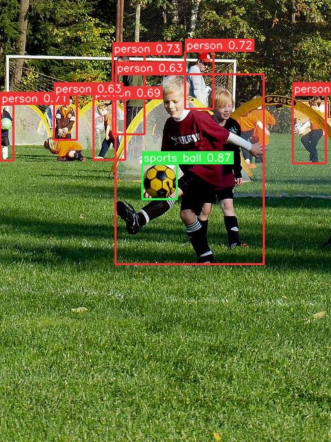

# DEIMv2.axera

[DEIMv2](https://github.com/Intellindust-AI-Lab/DEIMv2) Real-Time Object Detection Meets DINOv3, running on Axera NPU (AX650).



This repo contains the deployment-ready ONNX graph, the Pulsar2 build configuration, calibration data, and a minimal inference script.

| `deimv2_s.onnx` | (DEIMv2-DINOv3-s, 640x640, with in-graph post-processing). Verified on AX650A: mAP 0.603 on 64 COCO val images vs. 0.599 FP32 baseline, ~155 ms/image (NPU1). |

| `deimv2_x.onnx` | (DEIMv2-DINOv3-x, 640x640, with in-graph post-processing). Verified on AX650A: mAP 0.669 on 64 COCO val images vs. 0.662 FP32 baseline, ~155 ms/image (NPU1). | 

## Result

|               | float onnx | axmodel |
| ------------- | ---------- | ------- |
| mAP@0.50:0.95 | 0.599      | 0.603   |

## Build

Requires the Axera Pulsar2 toolchain (`pulsar2`).

```bash
pulsar2 build --config config.json
```

## Inference on board

Copy `compiled.axmodel`, `infer.py` and a test image to the board, then:

```bash
python3 infer.py -m compiled.axmodel -i test.jpg
```
Or
```bash
python3 infer.py -m compiled.axmodel -d /path/to/images --thr 0.6 -o vis/
```

Dependencies on board: `axengine`, `numpy`, `Pillow`.

On PC (FP32 reference):

```bash
python3 infer.py -m deimv2_s.onnx -i test.jpg   
```
## Note: freezing `orig_target_sizes` for production

`orig_target_sizes` only tells the post-processor how to scale boxes back to the
original image size. If your deployment always feeds images of one fixed
resolution (e.g. a 1920x1080 camera stream), you can hard-code it and drop the
second input: in the ONNX graph, replace the `orig_target_sizes` graph input
with an initializer holding `[w, h]`, remove the matching `input_configs` entry
from `config.json`, and rebuild. Do **not** do this if input resolutions vary —
boxes would be scaled with the wrong size.

## License

BSD 3-Clause License. See [LICENSE](LICENSE).
